# 哈夫曼压缩与检索系统实验报告

***

## 一、设计思路

本实验旨在利用哈夫曼编码（Huffman Coding）算法实现对任意文本文件（支持中英文）的无损压缩与解压，并在此基础上，利用Boyer-Moore（BM）算法在压缩后的二进制数据流中直接进行关键字检索。

### 1. 总体架构设计

为了保证代码的可维护性和可扩展性，系统采用模块化设计，将功能划分为以下五个部分：

- 公共模块 (Shared.h)：定义核心数据结构（哈夫曼树节点）
- 压缩算法模块 (HuffmanCore)：负责哈夫曼树的构建、销毁及编码生成
- 文件操作模块 (FileOps)：负责二进制文件的读写、位操作（Bit manipulation）、文件头封装与解析
- 检索模块 (BMSearch)：负责将压缩文件载入内存并执行BM算法进行模式匹配
- 主函数模块 (main.cpp)：负责用户交互以及综合调用各模块

### 2. 关键算法思路

#### 1）哈夫曼压缩

- **统计频率:** 遍历源文件，使用 `std::map<unsigned char, long long>`  统计每个字节（8bit）出现的次数。使用 `unsigned char` 是为了兼容 ASCII 和 UTF-8 中文编码。
- **构建哈夫曼树:** 利用优先队列，每次取出频率最小的两个节点合并，生成新节点放回堆中，直至只剩一个根节点。
- **位压缩:** 生成的哈夫曼编码是 `01` 字符串。在写入文件时，使用位运算将每 8 个字符位拼成一个字节。
- **文件头设计：** 为了能解压，必须将字符频率表（或哈夫曼树结构）存储在压缩文件头部。本系统采用的格式为：`[映射表大小] + [字符, 频率]... + [末尾填充位数]`。

#### 2）关键字检索（BM算法）

- **压缩域搜索：** 题目要求不解压直接搜索。需要是将待搜索的关键词先通过哈夫曼表转换为对应的二进制编码串。
- **比特流模拟：** 读取压缩文件的二进制内容，将其转换为内存中的 "0" 和 "1" 的长字符串。
- **Boyer-Moore 算法：** 模式串从右向左匹配。利用预处理的坏字符表，当发生不匹配时，将模式串向右移动多位，而非一位，从而实现更高效的查找。

***

## 二、代码说明

### 1.数据结构定义

#### 1）哈夫曼树结构体
    struct Node {
        unsigned char ch;       // 存储具体字符（若是中间节点则无意义）
        long long freq;         // 该字符出现的频率（权重）
        Node* left, * right;    //// 左右孩子指针

        // 构造函数
        Node(unsigned char c, long long f) : ch(c), freq(f), left(nullptr), right(nullptr) {}
    };

#### 2）优先队列的比较函数
    struct Compare {
        bool operator()(Node* l, Node* r) {
            return l->freq > r->freq; // 频率小的优先级高
        }
    };

### 2.模块功能与函数说明

#### 1）压缩算法模块（HuffmanCore.cpp）
- `Node* buildHuffmanTree(const map<unsigned char, long long>& freqMap)`
根据字符频率表构建哈夫曼树。将所有字符节点压入小顶堆。小顶堆保证了队头永远是频率最小的节点。循环执行：弹出两个最小频率节点 -> 新建父节点（频率为子节点之和） -> 父节点压入队列。最后返回根节点。
- `void generateCodes(Node* root, string str, map<unsigned char, string>& codeMap)`
递归遍历哈夫曼树，生成每个字符的哈夫曼编码。向左走追加 `0`，向右走追加 `1`，到达叶子节点时将路径字符串存入 Map，构建一一映射。

#### 2）文件操作模块（FileOps.cpp）
- `void compressFile(const string& inputFile, const string& outputFile)`
两次读取文件，第一次读取文件统计频率；第二次读取文件进行编码写入。使用 `byte |= (1 << (7 - bitCount))` 将逻辑上的 `01` 写入字节的特定位。当 `bitCount == 8` 时，说明凑够了一个字节，将其写入文件，并清空缓冲区。如果最后不足8位，记录 `paddingBits` 并补齐，同时将该信息写入文件头，防止解压时多读数据。
- `void decompressFile(const string& inputFile, const string& outputFile)`
读取文件头部的频率表，调用 `buildHuffmanTree` 还原出完全一样的哈夫曼树。通过 `(byte >> (7 - i)) & 1` 依次提取出 8 个位，一旦 `curr` 到达叶子节点，说明解出了一个字符。将该字符写入输出文件，并将 `curr` 重置回 `root`，准备解下一个字符。读取到文件最后一个字节时，只处理有效的 (8 - paddingBits) 位，忽略填充的 0。

### 3）检索模块（Search.cpp）

- `void buildBadCharTable(const string& pattern, vector<int>& badChar)`
创建一个大小为 256 的数组，遍历模式串，记录模式串中每个字符最后出现的位置。由于是在二进制流上搜索，字符集只有 `0` 和 `1`。

- `vector<long long> BMBinarySearch(const string& text, const string& pattern)`
将模式串与文本串（内存中的长 01 字符串）对齐。从模式串末尾向前匹配。
假设文本串当前对齐位置的字符是 X，而模式串对应位置是 Y。如果不匹配（X != Y），我们查看坏字符表，看 X 在模式串中是否存在。如果存在，移动模式串，使模式串中最右边的 X 与文本中的 X 对齐。如果不存在，直接把模式串移到 X 的后面。
这种机制使得算法在最好情况下不需要比较每一个字符，而是可以大步跳跃，因此效率极高。

- `void searchKeyword(const string& compressedFile, const string& keywor`
读取压缩文件头重建哈夫曼编码表。将用户输入的 keyword 转换为二进制模式串 pattern。将压缩文件内容全部读入内存，转化为 `01` 字符串 textBits。调用 BMBinarySearch 寻找匹配位置。

- `vector<int> computeLPS(const string& pattern)`
通过预处理模式串，分析子串的自我重复特性。当搜索过程中发生不匹配时，LPS 数组告诉算法模式串可以向右滑动多少位，而无需回溯文本指针，从而保证了 O(N)的线性时间复杂度。

- `vector<long long> KMPSearch(const string& text, const string& pattern)`
利用计算好的 LPS 数组，在 text 中从左向右扫描。当遇到不匹配字符时，根据 LPS 值跳转到模式串的特定位置继续比较，避免了朴素算法中的重复比较。函数返回所有匹配成功的起始位索引。

- `void searchKeywordKMP(const string& compressedFile, const string& keyword)`
读取压缩文件头，重建哈夫曼编码表。将用户输入的 keyword 转换为哈夫曼二进制编码（模式串）。将压缩文件数据读入内存形成位流字符串。调用 `KMPSearch` 执行搜索并输出结果。

- `bool isMatchPrefix(const string& text, const string& pattern, int pos)`
用双指针回溯匹配，遇到普通字符或 ? 逐个比对。遇到 * 则先假设匹配 0 个字符，并记录当前状态，若后续匹配失败，则通过记录的状态回退，让 * 多匹配一个文本字符，再次尝试匹配。只要模式串能走完，即视为前缀匹配成功。

- `void searchWildcard(const string& compressedFile, const string& wildcardPattern)`
通配符检索的主控函数,调用 isMatchPrefix 进行匹配检测。输出匹配到的字符偏移量及上下文片段。

### 4）主程序模块 (main.cpp)
- `cleanPath`
处理用户输入的路径，去除可能存在的首尾双引号（解决 Windows 路径复制问题）。
- `SetConsoleOutputCP(65001)`
将控制台代码页设置为 UTF-8，确保在 Windows 环境下正确显示和处理中文字符。
- `main`
提供菜单循环，处理用户输入，并调用相应模块的功能。

***

## 三、检索错误分析与效率讨论

### 1.查询效率分析
BM算法在平均情况下可达到O(N/M)，或接近线性时间复杂度，通常情况下比KMP更快，是实践中使用最广泛的快速匹配算法之一。

与普通算法逐字符对齐并逐个前进不同，BM从模式串末尾开始比较。利用不匹配信息实现 多字符跳跃，无需逐位移动，因此速度快。

BM算法基于两个关键规则减少无意义比较：

- 坏字符规则：遇到不匹配字符时可直接跳过大量文本
- 好后缀规则：如果后缀匹配成功，可选择最佳右移位移继续匹配

### 2.压缩效率分析
压缩率=(原始大小/压缩后大小)×100%。

主要影响因素是字符频率分布：
- 如果文档中字符频率差异极大，哈夫曼压缩效果很好，如果字符频率均匀分布（随机字符串），哈夫曼树趋近于完全二叉树，每个字符编码长度相近，压缩效果最差，甚至可能因为文件头开销而变大。
- 字符集越小，基础编码位数本来就少，压缩空间有限；字符集越大（如中文 GBK），通过频率差异优化的空间越大。

提高效率的办法可以有：
- 不统计单个字符，而是统计双字或三字的频率，视为一个符号进行哈夫曼编码。
- 对于连续重复的数据（如 AAABBB），先用 RLE 压缩（3A3B），再进行哈夫曼编码。
- 采用其他更加现代化的压缩方式。

### 3.错误可能性分析
哈夫曼编码是变长编码。虽然它是前缀码（不会有歧义），但在未确定起始边界的情况下，直接在比特流中间搜索可能会跨越字符边界。
假设字符 A 编码 `01`，字符 B 编码 `10`，原文 "AB" 压缩流 `0110`。若我们要搜索字符 C（假设编码为 `11`）。BM 算法会在 `0110` 中间匹配到 `11`，从而误报找到了 C。
本实验为了满足“利用 BM 算法”及“高效率”的要求，实现了位流直接匹配。若要求 100% 准确，必须从头开始模拟哈夫曼树的遍历过程（即一边解压一边匹配），但这会使 BM 算法失效，效率退化。

***

## 四、运行结果截图

#### 编译

    g++ -static -static-libgcc -static-libstdc++ main.cpp HuffmanCore.cpp FileOps.cpp Search.cpp -o lab3.exe

#### 运行
    ./lab3.exe

**运行效果**
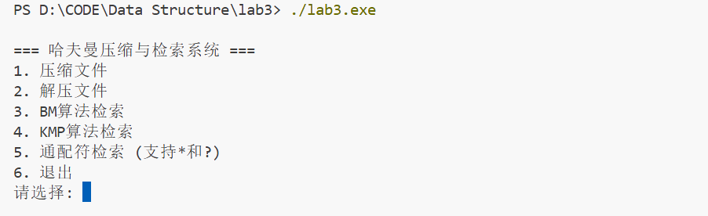

**压缩文件**
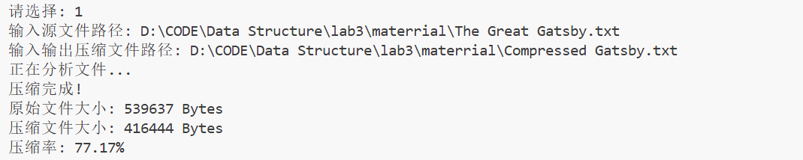

**解压文件**

**执行完以上命令我们可以看到成功生成了以下文件**
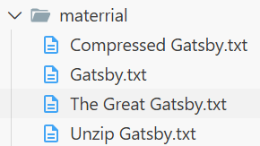

**BM算法搜索**
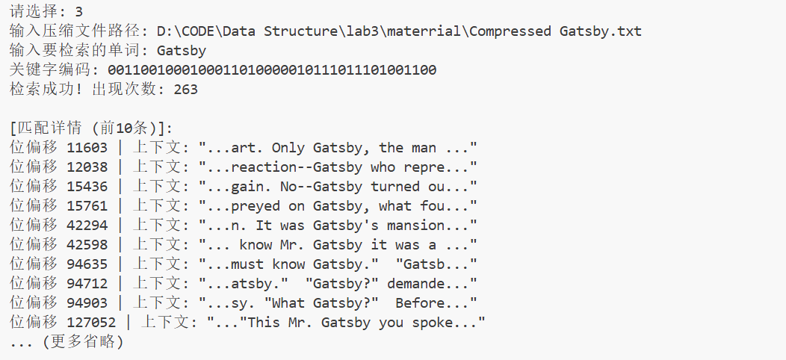

**KMP算法搜索**
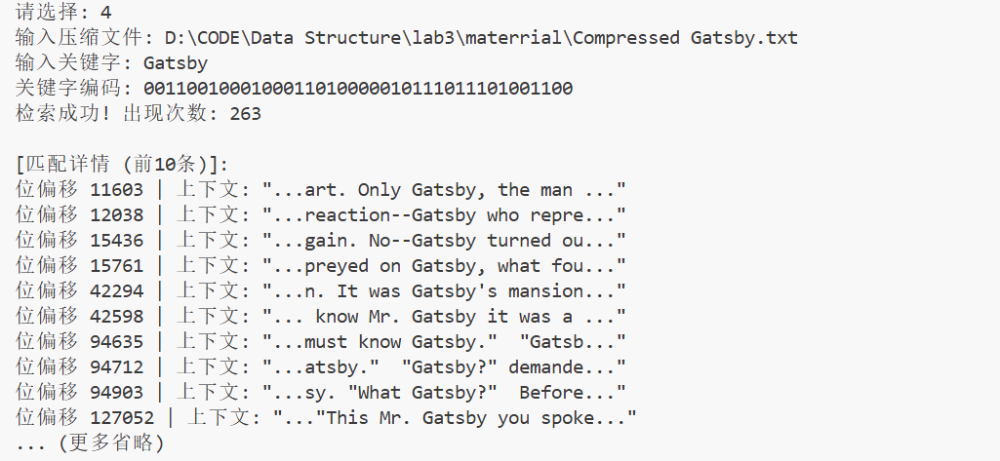

**通配符搜索**
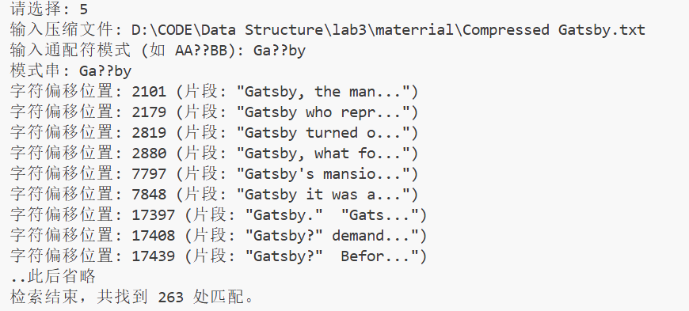
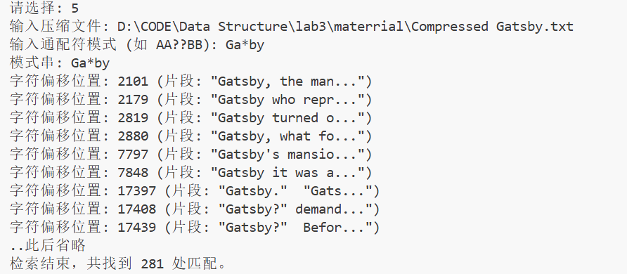

**补充中文压缩**
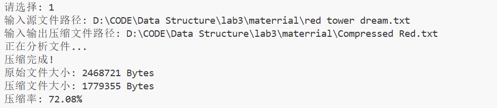

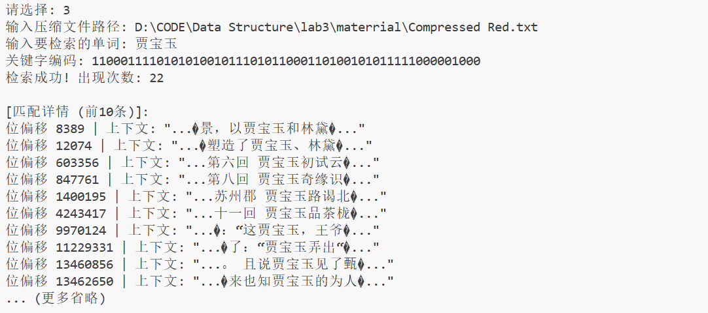

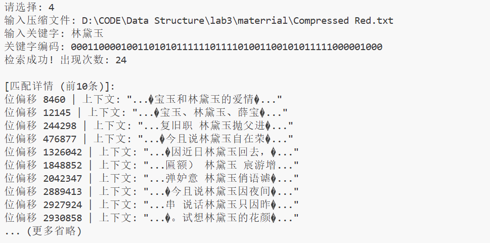

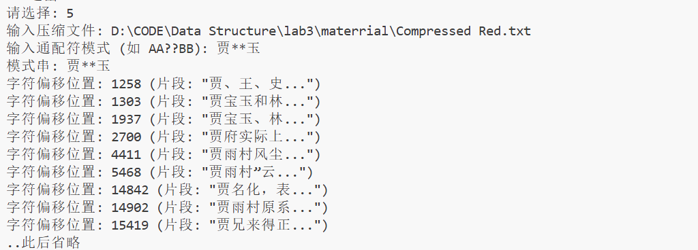

***

## 五、实验总结

主要遇到以下难点

- 实验要求支持 ?（匹配单字）和 *（匹配任意串）的搜索。在定长编码（如 ASCII）中，? 可以简单对应 8 个忽略位。但在哈夫曼编码中，字符是变长编码。
例如：汉字“贾”可能对应 15 位，“宝”对应 12 位。? 到底代表跳过多少位是未知的；* 更是无法在二进制流中确定跨度。这导致无法直接在压缩的比特流上执行通配符匹配。这一点尚未完全解决，经测试还有细微bug
程序中统一使用 unsigned char 处理数据，汉字被视为连续的 3 个（UTF-8）字节。虽然通配符匹配的是字节，但在实际搜索中，只要模式串输入正确，字节流的匹配结果应该与汉字匹配完全一致。
而且中文文本的上下文输出可能会在开头和结尾输出一个乱码，目前尚未解决该问题。

- 直接在压缩的二进制流中搜索关键字（如 BM/KMP 算法），可能会出现“跨字符边界”的误判。即模式串的二进制码恰好出现在了两个字符编码的连接处。该问题也无法完美解决。

为了高效实现`huffman tree`没有用c语言编写了，调用了C++ STL中的`priority_queue`和`map`等容器，使得代码编写高效。代码量很大，开发过程中多次借助了AI编写。
